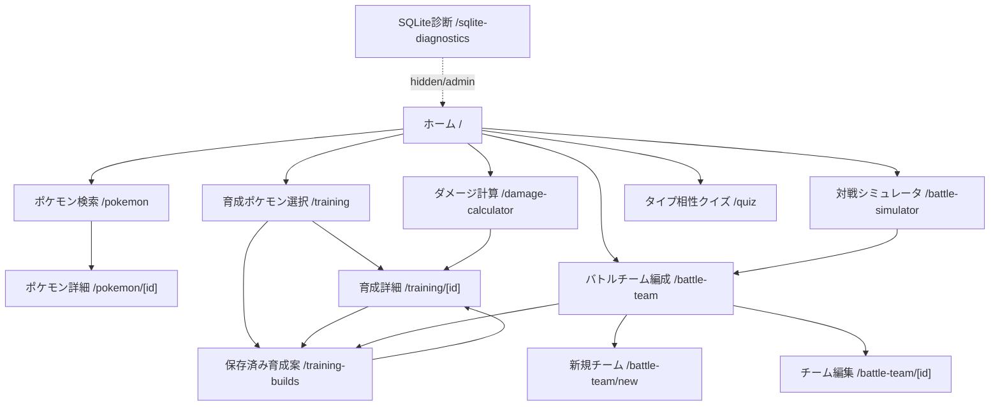
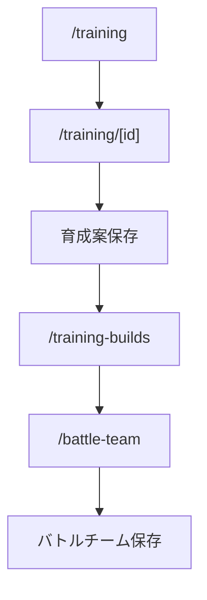
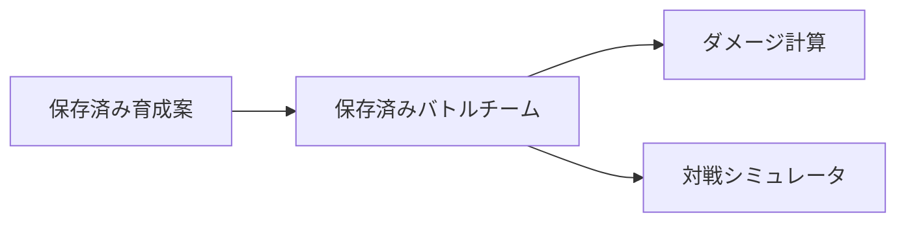
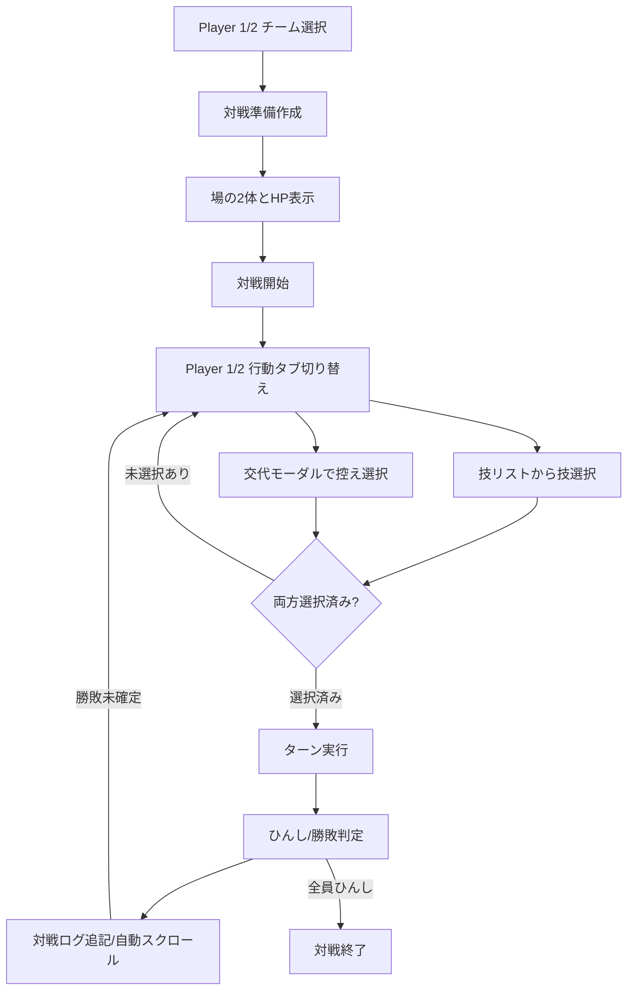

# 画面遷移図

## 全体遷移

```mermaid
flowchart TD
  Home["ホーム /"]
  PokemonSearch["ポケモン検索 /pokemon"]
  PokemonDetail["ポケモン詳細 /pokemon/[id]"]
  TrainingSearch["育成ポケモン選択 /training"]
  TrainingDetail["育成詳細 /training/[id]"]
  TrainingBuilds["保存済み育成案 /training-builds"]
  BattleTeam["バトルチーム編成 /battle-team"]
  BattleTeamNew["新規チーム /battle-team/new"]
  BattleTeamEdit["チーム編集 /battle-team/[id]"]
  DamageCalc["ダメージ計算 /damage-calculator"]
  BattleSim["対戦シミュレータ /battle-simulator"]
  Quiz["タイプ相性クイズ /quiz"]
  Diagnostics["SQLite診断 /sqlite-diagnostics"]

  Home --> PokemonSearch
  Home --> TrainingSearch
  Home --> BattleTeam
  Home --> DamageCalc
  Home --> BattleSim
  Home --> Quiz

  PokemonSearch --> PokemonDetail
  TrainingSearch --> TrainingDetail
  TrainingSearch --> TrainingBuilds
  TrainingDetail --> TrainingBuilds
  TrainingBuilds --> TrainingDetail

  BattleTeam --> BattleTeamNew
  BattleTeam --> BattleTeamEdit
  BattleTeam --> TrainingBuilds

  DamageCalc --> TrainingDetail
  BattleSim --> BattleTeam

  Diagnostics -. hidden/admin .-> Home
```

## 育成からチーム編成まで

```mermaid
flowchart TD
  TrainingSearch["/training"]
  TrainingDetail["/training/[id]"]
  SaveBuild["育成案保存"]
  TrainingBuilds["/training-builds"]
  BattleTeam["/battle-team"]
  SaveTeam["バトルチーム保存"]

  TrainingSearch --> TrainingDetail
  TrainingDetail --> SaveBuild
  SaveBuild --> TrainingBuilds
  TrainingBuilds --> BattleTeam
  BattleTeam --> SaveTeam
```

## チーム利用機能

```mermaid
flowchart LR
  Builds["保存済み育成案"]
  Teams["保存済みバトルチーム"]
  DamageCalc["ダメージ計算"]
  BattleSim["対戦シミュレータ"]

  Builds --> Teams
  Teams --> DamageCalc
  Teams --> BattleSim
```

## 対戦シミュレータ内フロー

```mermaid
flowchart TD
  SelectTeams["Player 1/2 チーム選択"]
  Prepare["対戦準備作成"]
  Preview["場の2体とHP表示"]
  Start["対戦開始"]
  Tab["Player 1/2 行動タブ切り替え"]
  Move["技リストから技選択"]
  SwitchModal["交代モーダルで控え選択"]
  Ready{"両方選択済み?"}
  Execute["ターン実行"]
  Judge["ひんし/勝敗判定"]
  Log["対戦ログ追記/自動スクロール"]
  Finished["対戦終了"]

  SelectTeams --> Prepare
  Prepare --> Preview
  Preview --> Start
  Start --> Tab
  Tab --> Move
  Tab --> SwitchModal
  Move --> Ready
  SwitchModal --> Ready
  Ready -->|未選択あり| Tab
  Ready -->|選択済み| Execute
  Execute --> Judge
  Judge --> Log
  Log -->|勝敗未確定| Tab
  Judge -->|全員ひんし| Finished
```
