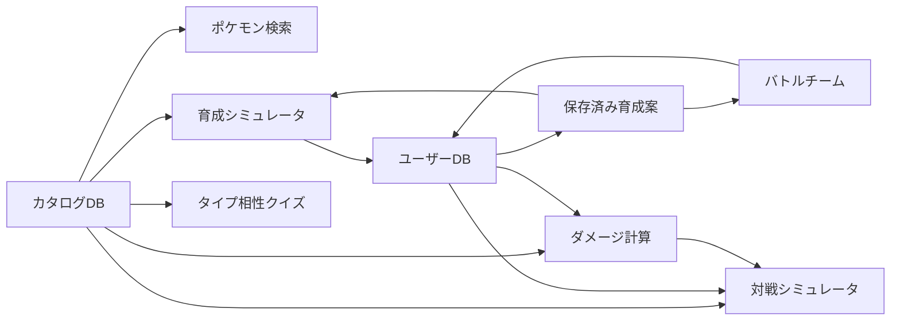

# 機能間のつながり

## 依存関係サマリー

| 機能 | 依存するデータ/機能 | 利用先 |
|---|---|---|
| ポケモン検索 | カタログDB | ポケモン詳細、育成シミュレータ |
| ポケモン詳細 | カタログDB | 情報確認 |
| タイプ相性表 | タイプ相性データ | ダメージ計算、クイズ、共通確認 |
| タイプ相性クイズ | タイプ相性データ | 学習、ミス履歴 |
| 育成シミュレータ | カタログDB、性格、持ち物、技、ユーザーDB | 保存済み育成案 |
| 保存済み育成案一覧 | ユーザーDB | 育成詳細、バトルチーム編成 |
| バトルチーム編成 | 保存済み育成案、ユーザーDB | ダメージ計算、対戦シミュレータ |
| ダメージ計算 | カタログDB、保存済みチーム、保存済み育成案、最近使用履歴 | 対戦前確認 |
| 対戦シミュレータ | 保存済みバトルチーム、保存済み育成案、カタログDB、ダメージ計算 | 1人回し対戦 |
| SQLite診断 | SQLite WASM、catalog DB、user DB | 開発/診断 |

## データ利用の流れ

## 機能別のつながり

### 育成シミュレータとバトルチーム

育成シミュレータで作成した育成案は、バトルチーム編成の材料になる。
バトルチームは育成案IDの並びを保存し、個々の育成内容は育成案側に保持する。

### バトルチームとダメージ計算

ダメージ計算では、保存済みバトルチームを選択し、チームメンバーを攻撃側または防御側に反映できる。
このとき、育成案の能力ポイント、性格、持ち物、特性、技をダメージ計算用の状態へ変換する。

### バトルチームと対戦シミュレータ

対戦シミュレータでは、Player 1とPlayer 2に保存済みバトルチームを選ぶ。
各チームの育成案を読み込み、対戦用のHP、技、持ち物、特性、控え一覧を作成する。

### ダメージ計算と対戦シミュレータ

対戦シミュレータの技ダメージは、ダメージ計算機能の計算器を利用する。
ただし、対戦シミュレータでは現状、計算結果の最小値と最大値の平均を実ダメージとして採用する。
