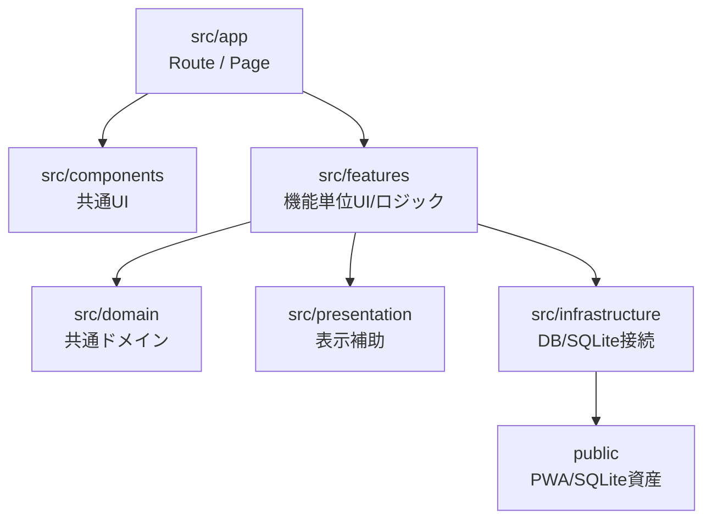
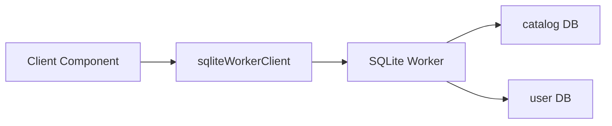

# アーキテクチャ概要

## 技術スタック

| 項目 | 採用技術 |
|---|---|
| フレームワーク | Next.js App Router |
| UI | React Client/Server Components |
| 言語 | TypeScript |
| スタイル | CSS Modules |
| カタログDB | SQLite WASM + 圧縮済みSQLite DB |
| ユーザーDB | ブラウザ内SQLite |
| ダメージ計算 | `@smogon/calc` |
| PWA | Service Worker + Web App Manifest |

## レイヤ構成

## ディレクトリ責務

| ディレクトリ | 役割 |
|---|---|
| `src/app` | Next.js App Routerのページ、ルート、共通レイアウト。 |
| `src/components` | 複数画面で使う共通UI。ヘッダー、戻るボタン、PWA登録など。 |
| `src/domain` | 特定機能に閉じない共通ドメインロジック。タイプ相性、名前検索正規化など。 |
| `src/features` | 機能単位のコンポーネント、スタイル、ドメイン型、リポジトリ。 |
| `src/infrastructure` | SQLite WASMクライアント、カタログ検索リポジトリ。 |
| `src/presentation` | 表示用の色やスタイル補助。 |
| `database` | SQLiteスキーマ、マイグレーション、seed CSV。 |
| `scripts` | DB初期化、PokeAPI/Championsデータ取得、SQLite資産生成。 |
| `public` | PWA資産、Service Worker、SQLite WASM、圧縮済みcatalog DB。 |

## Server ComponentとClient Componentの使い分け

### Server Component

主にページの枠、静的なレイアウト、検索パラメータを受ける入口に使う。

例:

- `src/app/page.tsx`
- `src/app/pokemon/page.tsx`
- `src/app/training/page.tsx`
- `src/app/damage-calculator/page.tsx`
- `src/app/battle-simulator/page.tsx`

### Client Component

ブラウザ内SQLite、Service Worker、フォーム操作、状態管理を扱う箇所に使う。

例:

- `DamageCalculatorCatalogLoader`
- `DamageCalculator`
- `TrainingSimulator`
- `SavedTrainingBuilds`
- `BattleSimulator`
- `QuizCatalogLoader`
- `ServiceWorkerRegister`

## データアクセス方針

- カタログ系データは `catalogQuery` で読む。
- ユーザー保存データは `query` / `execute` / `transaction` で読む/書く。
- UIコンポーネントが直接SQLを持つのではなく、機能ごとのリポジトリ関数を経由する。

## 機能単位の分割

| 機能 | 主なディレクトリ |
|---|---|
| ポケモン検索/詳細 | `src/app/pokemon`, `src/infrastructure/database` |
| 育成シミュレータ | `src/features/training` |
| バトルチーム | `src/features/training`, `src/app/battle-team` |
| ダメージ計算 | `src/features/damage-calculator` |
| 対戦シミュレータ | `src/features/battle-simulator` |
| クイズ | `src/features/quiz` |
| SQLite診断 | `src/app/sqlite-diagnostics` |

## 設計上の注意点

- ブラウザ内SQLiteを使うため、多くの機能はClient Componentで初回ロード後にデータを取得する。
- DB資産はビルド時に再生成されるため、`data/pokemon-lab.db` が作業ツリー上で変更扱いになることがある。
- PWAキャッシュは本番環境で有効化される。
