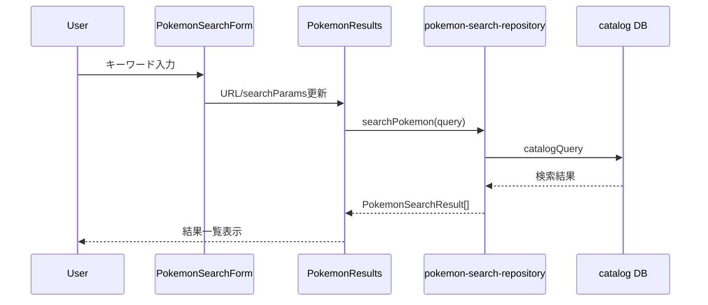
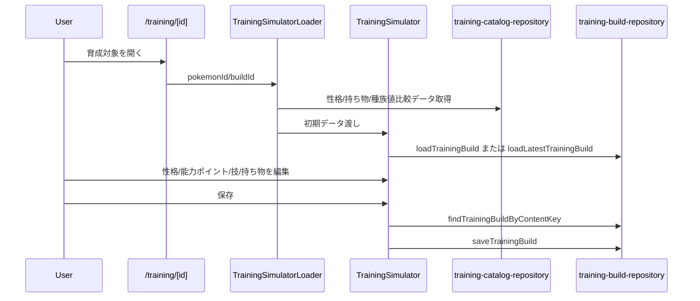
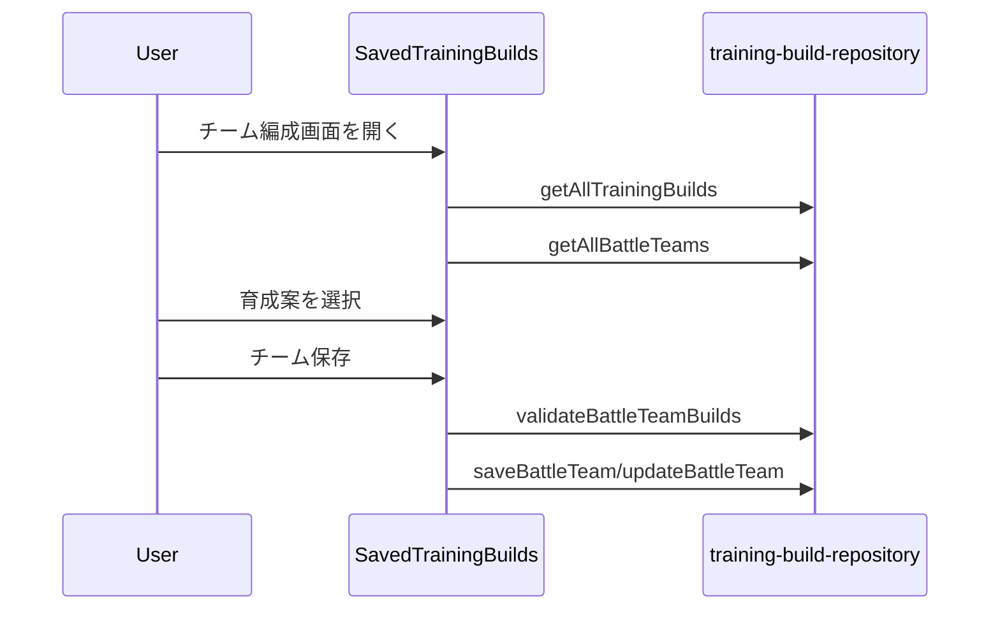
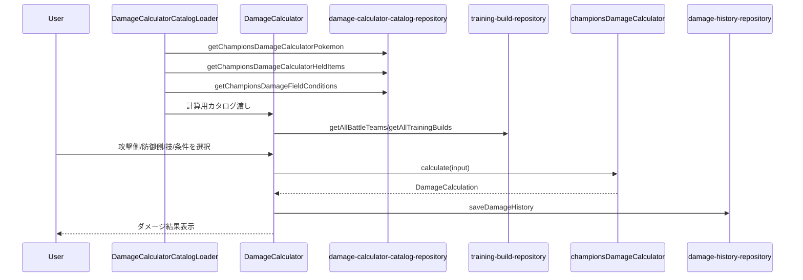
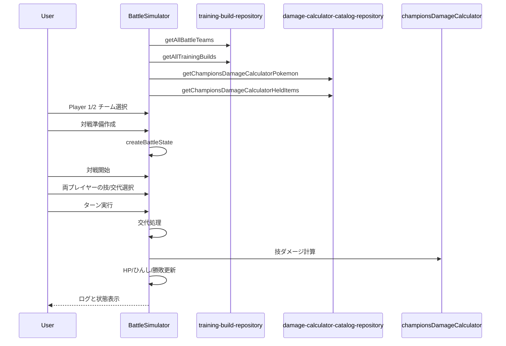
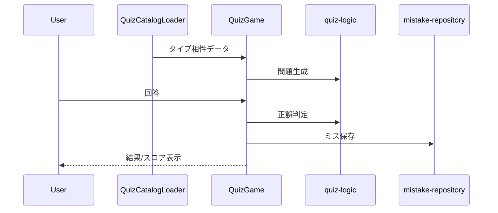

# 主要ユースケースの処理フロー

## ポケモン検索

```mermaid
sequenceDiagram
  participant User
  participant SearchForm as PokemonSearchForm
  participant Results as PokemonResults
  participant Repo as pokemon-search-repository
  participant DB as catalog DB

  User->>SearchForm: キーワード入力
  SearchForm->>Results: URL/searchParams更新
  Results->>Repo: searchPokemon(query)
  Repo->>DB: catalogQuery
  DB-->>Repo: 検索結果
  Repo-->>Results: PokemonSearchResult[]
  Results-->>User: 結果一覧表示
```

## 育成案作成

```mermaid
sequenceDiagram
  participant User
  participant Page as /training/[id]
  participant Loader as TrainingSimulatorLoader
  participant Sim as TrainingSimulator
  participant Catalog as training-catalog-repository
  participant BuildRepo as training-build-repository

  User->>Page: 育成対象を開く
  Page->>Loader: pokemonId/buildId
  Loader->>Catalog: 性格/持ち物/種族値比較データ取得
  Loader->>Sim: 初期データ渡し
  Sim->>BuildRepo: loadTrainingBuild または loadLatestTrainingBuild
  User->>Sim: 性格/能力ポイント/技/持ち物を編集
  User->>Sim: 保存
  Sim->>BuildRepo: findTrainingBuildByContentKey
  Sim->>BuildRepo: saveTrainingBuild
```

## バトルチーム作成

```mermaid
sequenceDiagram
  participant User
  participant UI as SavedTrainingBuilds
  participant Repo as training-build-repository

  User->>UI: チーム編成画面を開く
  UI->>Repo: getAllTrainingBuilds
  UI->>Repo: getAllBattleTeams
  User->>UI: 育成案を選択
  User->>UI: チーム保存
  UI->>Repo: validateBattleTeamBuilds
  UI->>Repo: saveBattleTeam/updateBattleTeam
```

## ダメージ計算

```mermaid
sequenceDiagram
  participant User
  participant Loader as DamageCalculatorCatalogLoader
  participant UI as DamageCalculator
  participant Catalog as damage-calculator-catalog-repository
  participant Teams as training-build-repository
  participant Calc as championsDamageCalculator
  participant History as damage-history-repository

  Loader->>Catalog: getChampionsDamageCalculatorPokemon
  Loader->>Catalog: getChampionsDamageCalculatorHeldItems
  Loader->>Catalog: getChampionsDamageFieldConditions
  Loader->>UI: 計算用カタログ渡し
  UI->>Teams: getAllBattleTeams/getAllTrainingBuilds
  User->>UI: 攻撃側/防御側/技/条件を選択
  UI->>Calc: calculate(input)
  Calc-->>UI: DamageCalculation
  UI->>History: saveDamageHistory
  UI-->>User: ダメージ結果表示
```

## 対戦シミュレータ

```mermaid
sequenceDiagram
  participant User
  participant UI as BattleSimulator
  participant TeamRepo as training-build-repository
  participant Catalog as damage-calculator-catalog-repository
  participant Calc as championsDamageCalculator

  UI->>TeamRepo: getAllBattleTeams
  UI->>TeamRepo: getAllTrainingBuilds
  UI->>Catalog: getChampionsDamageCalculatorPokemon
  UI->>Catalog: getChampionsDamageCalculatorHeldItems
  User->>UI: Player 1/2 チーム選択
  User->>UI: 対戦準備作成
  UI->>UI: createBattleState
  User->>UI: 対戦開始
  User->>UI: 両プレイヤーの技/交代選択
  User->>UI: ターン実行
  UI->>UI: 交代処理
  UI->>Calc: 技ダメージ計算
  UI->>UI: HP/ひんし/勝敗更新
  UI-->>User: ログと状態表示
```

## クイズ

```mermaid
sequenceDiagram
  participant User
  participant Loader as QuizCatalogLoader
  participant Game as QuizGame
  participant Logic as quiz-logic
  participant Mistakes as mistake-repository

  Loader->>Game: タイプ相性データ
  Game->>Logic: 問題生成
  User->>Game: 回答
  Game->>Logic: 正誤判定
  Game->>Mistakes: ミス保存
  Game-->>User: 結果/スコア表示
```
