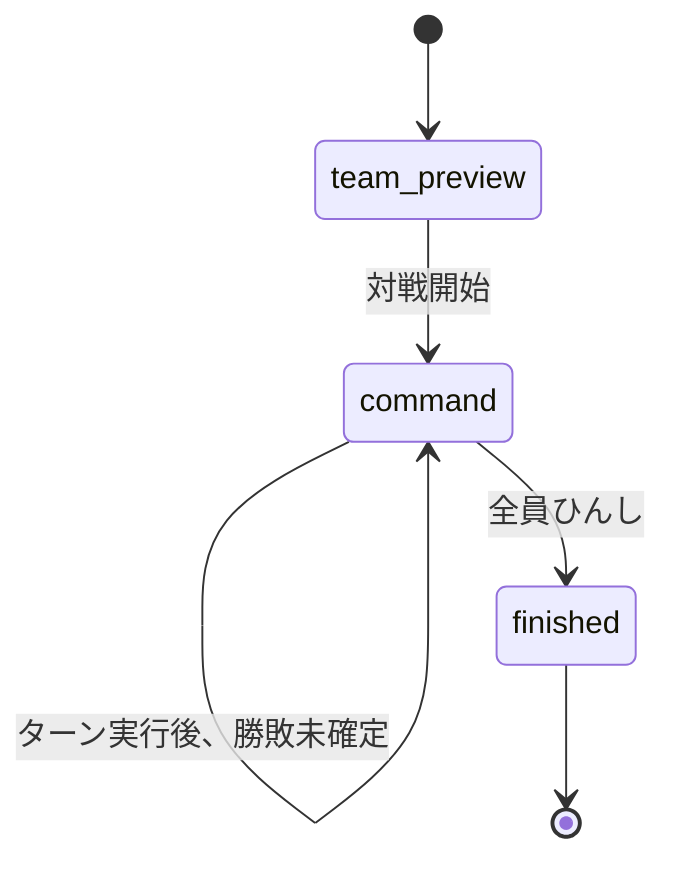
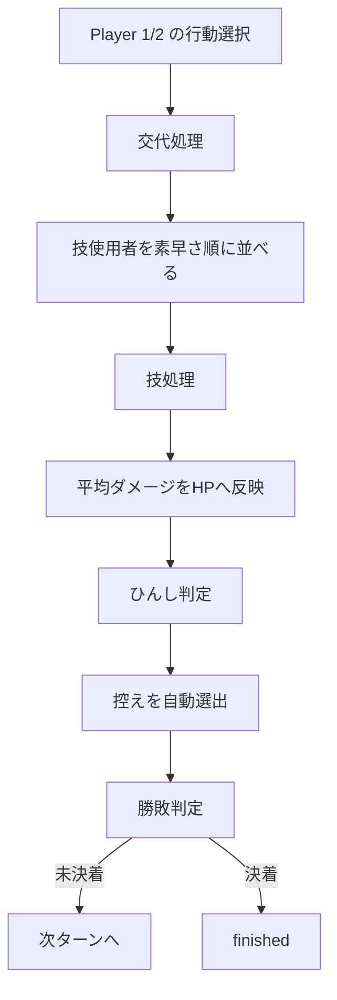

# ダメージ計算と対戦シミュレータ

## ダメージ計算モジュール

### 主な型

ファイル: `src/features/damage-calculator/domain/damage-calculator-types.ts`

| 型 | 役割 |
|---|---|
| `DamageCalculatorPokemon` | ダメージ計算対象のポケモン情報。 |
| `DamageCalculatorMove` | ダメージ技情報。 |
| `DamageCalculatorAbility` | 特性とダメージ補正。 |
| `DamageCalculatorHeldItem` | 持ち物とダメージ補正。 |
| `DamageCalculatorWeather` | 天候条件。 |
| `DamageCalculatorTerrain` | フィールド条件。 |

### 計算器

ファイル:

- `src/features/damage-calculator/application/smogon-damage-calculator.ts`
- `src/features/damage-calculator/config/champions-damage-ruleset.ts`

主要要素:

| 要素 | 役割 |
|---|---|
| `SmogonDamageCalculator` | アプリ内データを `@smogon/calc` に渡せる形式へ変換する。 |
| `DamageCalculatorRuleset` | 世代、レベル、個体値、努力値、補正フックを定義する。 |
| `CHAMPIONS_DAMAGE_RULESET` | Pokemon Champions向けのルールセット。 |
| `championsDamageCalculator` | 実際に使う計算器インスタンス。 |

### 入力変換

`SmogonDamageCalculator` は以下を行う。

- DB由来のポケモン名/技名をSmogon側IDへ正規化する。
- アプリ内の種族値、実数値、タイプ、体重を `@smogon/calc` の `Pokemon` に変換する。
- 技の威力、タイプ、物理/特殊分類を `Move` に変換する。
- 持ち物/特性による補正を計算前後に適用する。
- 計算結果を `DamageCalculation` に整形する。

## ダメージ計算画面

ファイル: `src/features/damage-calculator/components/damage-calculator.tsx`

主な内部状態:

| 状態 | 内容 |
|---|---|
| 攻撃側/防御側ポケモン | 選択中のポケモン。 |
| 技ID | 攻撃側の使用技。 |
| 天候/フィールド | 場の条件。 |
| バトルチーム | 保存済みチーム一覧。 |
| 育成案 | 保存済み育成案一覧。 |
| 能力補正 | 能力ポイント、ランク、性格補正。 |
| 計算結果 | 通常/急所のダメージ結果。 |

## 対戦シミュレータの状態モデル

ファイル: `src/features/battle-simulator/domain/battle-simulator-types.ts`

### 型

| 型 | 内容 |
|---|---|
| `BattlePlayerId` | `player1` または `player2`。 |
| `BattleMoveSlot` | 対戦中に選択できる技。 |
| `BattleCommand` | 技または交代の行動。 |
| `BattlePokemon` | 対戦中ポケモンのHP、技、持ち物、特性など。 |
| `BattlePlayerState` | プレイヤーごとのチーム、先頭、表示名。 |
| `BattleLogEntry` | 対戦ログ1件。 |
| `BattleState` | 対戦全体の状態。 |

### 状態遷移



### コマンド

```ts
type BattleCommand =
  | { type: "move"; moveId: string }
  | { type: "switch"; targetIndex: number };
```

## ターン処理

ファイル: `src/features/battle-simulator/components/battle-simulator.tsx`

主要関数:

| 関数 | 役割 |
|---|---|
| `createBattleState` | 選択された2チームから初期対戦状態を作る。 |
| `startBattle` | `team-preview` から `command` フェーズへ進める。 |
| `setPendingCommand` | Playerごとの行動を保存する。 |
| `executeTurn` | 1ターン分の処理を行う。 |
| `applySwitchCommand` | 交代コマンドを適用する。 |
| `applyMoveCommand` | 技コマンドを適用し、ダメージとひんし判定を行う。 |
| `toDamagePokemon` | `BattlePokemon` をダメージ計算用ポケモンへ変換する。 |
| `toDamageMove` | 対戦中の技をダメージ計算用技へ変換する。 |

主要UI要素:

| 要素 | 役割 |
|---|---|
| `BattleField` | 場に出ている2体を横並びで表示し、HPパネルを重ねて配置する。 |
| `HpPanel` | PlayerごとのHPバー、ポケモン名、HP数値を表示する。 |
| `BattleLog` | 固定高のログ領域を表示する。ログ追加時は最新ログが見える位置へ自動スクロールする。 |
| `ActionTabs` | Player 1/2の行動選択UIをタブで切り替える。 |
| `SwitchModal` | 交代先の控えポケモンを選ぶモーダル。 |

主なUI状態:

| 状態 | 内容 |
|---|---|
| `activeCommandPlayer` | 行動選択セクションで表示中のプレイヤー。 |
| `switchModalPlayer` | 交代先選択モーダルを開いているプレイヤー。 |
| `logRef` | 対戦ログ領域のスクロール制御に使う参照。 |

### 処理順



## 現在の簡易仕様

現在の対戦シミュレータは、完全な対戦エンジンではない。

採用している簡易仕様:

- 交代は技より先に処理する。
- 技は素早さ順で処理する。
- ダメージは最小値と最大値の平均を採用する。
- HPが0になったらひんし。
- ひんし後の控えは自動で先頭から選ぶ。

未対応:

- 命中
- PP
- 優先度
- 急所
- 状態異常
- ランク変化
- 天候/フィールド効果の操作
- 特性/持ち物の完全自動発動
