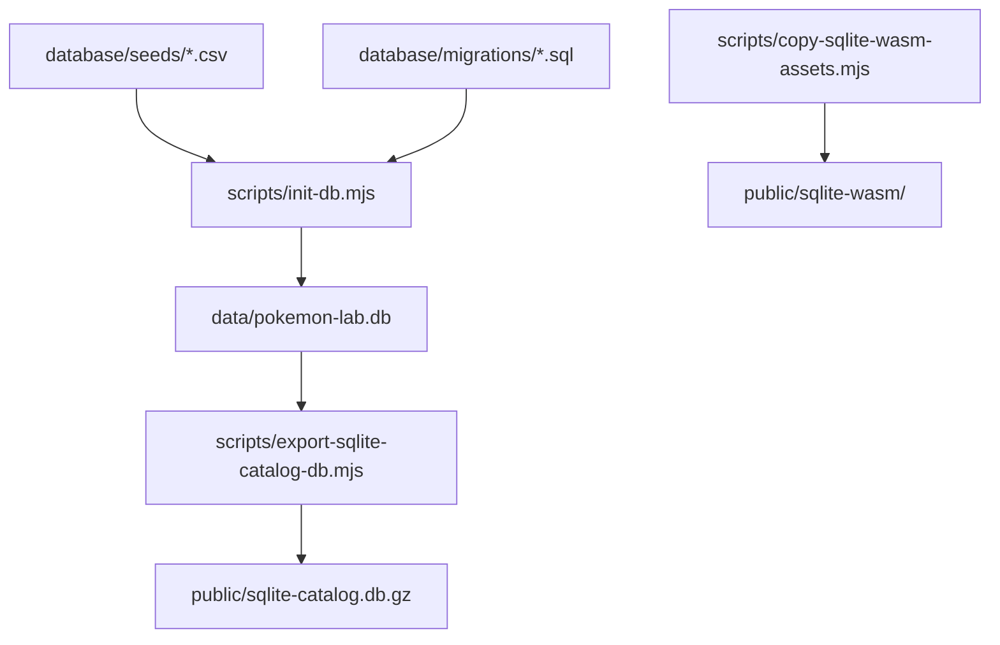

# ビルド、検証、保守作業

## npm scripts

| script | 内容 |
|---|---|
| `npm run sqlite:assets` | SQLite WASM資産コピーとcatalog DBエクスポートを行う。 |
| `npm run db:init` | migrationsとseedsから `data/pokemon-lab.db` を生成する。 |
| `npm run dev` | 開発サーバーを起動する。`predev` でDB/資産生成が走る。 |
| `npm run build` | 本番ビルドを行う。`prebuild` でDB/資産生成が走る。 |
| `npm run start` | ビルド済みアプリを起動する。 |
| `npm run lint` | ESLintを実行する。 |
| `npm run seeds:fetch` | PokeAPI/Champions系seedをまとめて取得する。 |
| `npm run seeds:validate` | seed CSVの整合性を検証する。 |
| `npm run champions:fetch` | Champions関連seedを取得する。 |
| `npm run items:fetch` | item関連seedを取得する。 |

## DB生成フロー

## seed取得スクリプト

| ファイル | 内容 |
|---|---|
| `scripts/fetch-pokeapi-seeds.mjs` | PokeAPI由来のポケモン、フォーム、技、特性などを取得する。 |
| `scripts/fetch-pokeapi-items.mjs` | PokeAPI由来の持ち物を取得する。 |
| `scripts/fetch-champions-seed.mjs` | Pokemon Champions対象フォームを取得する。 |
| `scripts/fetch-champions-items.mjs` | Champions用持ち物を取得する。 |
| `scripts/fetch-champions-move-usage.mjs` | Championsフォーム別の技使用率を取得する。 |
| `scripts/validate-pokeapi-seeds.mjs` | seed CSVの参照整合性、重複、必須値を検証する。 |

## 通常の検証手順

コード変更時:

1. `npm.cmd run lint`
2. 必要に応じて `npm.cmd run build`
3. 画面変更時はローカルサーバーで該当画面を確認する。

DB/seed変更時:

1. seed取得またはCSV編集を行う。
2. `npm.cmd run seeds:validate`
3. `npm.cmd run db:init`
4. `npm.cmd run sqlite:assets`
5. 影響する画面で読み込み確認を行う。

## 変更時の影響範囲

| 変更対象 | 確認する機能 |
|---|---|
| `type_matchups` / `TypeMatchup` | タイプ相性表、クイズ、ダメージ計算のタイプ相性。 |
| `training-build-repository.ts` | 育成保存、保存済み育成案、バトルチーム、ダメージ計算の育成案適用、対戦シミュレータ。 |
| `damage-calculator-types.ts` | ダメージ計算、対戦シミュレータ。 |
| `smogon-damage-calculator.ts` | ダメージ結果、対戦中の技ダメージ。 |
| `sqlite-client.ts` / `sqlite-runtime-worker.mjs` | 全機能のDB読み書き、SQLite診断。 |
| `public/sw.js` | PWAキャッシュ、オフライン挙動。 |

## Git運用メモ

- `predev` / `prebuild` により `data/pokemon-lab.db` が変更扱いになることがある。
- docsのみ、UIのみの変更では意図しないDB生成差分をステージしない。
- `public/sqlite-catalog.db.gz` や `public/sqlite-wasm/` の差分は、DB/SQLite資産更新が目的のときだけ含める。
- Vercelデプロイを避けたいdocs更新では、コミットメッセージに `[skip ci]` を含める運用がある。

## 保守時の実装ルール

- 新しい画面は `src/app` にページ入口を作り、複雑な状態は `src/features/<feature>` に分離する。
- 共通UIは `src/components`、共通ドメインロジックは `src/domain` に置く。
- DBアクセスはリポジトリ関数に閉じ込め、コンポーネントへSQLを直接書かない。
- ダメージ計算に関わる補正は、画面側ではなく `SmogonDamageCalculator` または ruleset に寄せる。
- 対戦シミュレータで使う計算は、可能な限りダメージ計算機能の型と計算器を再利用する。

